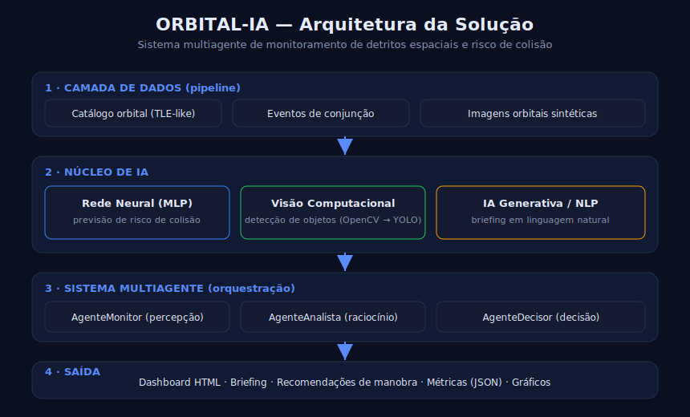

# 🛰️ ORBITAL-IA

### Sistema Multiagente Inteligente para Monitoramento de Detritos Espaciais e Previsão de Risco de Colisão

**Global Solution 2026.1 — FIAP · Curso de Inteligência Artificial (Fases 6 e 7)**
Prova de Conceito (POC) para a economia espacial.

---

## 👥 Integrantes

| Nome | RM | Turma |
|------|----|-------|
| Matheus Augusto Rodrigues Maia | RM 560683 | 2TIAOR |
| Bruno Henrique Nielsen Conter | RM 560518 | 2TIAOR |
| Fabio Santos Cardoso | RM 560479 | 2TIAOR |

> ⚠️ Não esqueça de preencher o nome dos integrantes (exigência da entrega).

---

## 🎯 O problema

A pergunta da Global Solution é: **“Como tecnologias avançadas de Inteligência Artificial e
computação podem impulsionar a nova economia espacial e gerar impacto positivo na Terra?”**

Hoje há mais de **130 milhões de fragmentos de detritos espaciais** orbitando a Terra. Eles
ameaçam os satélites que sustentam serviços essenciais no planeta: monitoramento climático,
previsão de desastres, telecomunicações, internet e navegação por GPS. Uma única colisão pode
gerar milhares de novos fragmentos (efeito *Kessler*), comprometendo toda essa infraestrutura.

**Proteger esses ativos orbitais é, na prática, proteger serviços críticos na Terra.**

## 💡 A solução

O **ORBITAL-IA** é uma POC que integra **rede neural, visão computacional, sistema multiagente
e IA generativa** em um único pipeline que:

1. ingere o catálogo de objetos em órbita e detecta aproximações (conjunções);
2. prevê, com uma **rede neural**, a probabilidade de colisão de cada conjunção;
3. detecta objetos em imagens orbitais com **visão computacional**;
4. coordena tudo através de um **sistema multiagente** (percepção → raciocínio → decisão);
5. gera, com **IA generativa**, um briefing operacional em linguagem natural com as ações
   recomendadas (manobras evasivas, monitoramento etc.);
6. apresenta os resultados em um **dashboard** visual.

## 🏗️ Arquitetura



| Camada | Componente | Tecnologia |
|--------|-----------|------------|
| 1. Dados | Catálogo orbital, eventos de conjunção, imagens | `pandas`, `numpy` |
| 2. Núcleo de IA | Rede neural de risco | `scikit-learn` (MLP) |
| | Visão computacional | `OpenCV` (evolução para `YOLO`) |
| | IA Generativa / NLP | Template + API Anthropic (opcional) |
| 3. Multiagente | Monitor · Analista · Decisor | Python (barramento de mensagens) |
| 4. Saída | Dashboard, briefing, métricas | HTML + `matplotlib` + JSON |

## 🧠 Tecnologias e conceitos das Fases 6 e 7 aplicados

- **Redes neurais** — `MLPClassifier` para classificação de risco de colisão.
- **Sistemas multiagentes** — três agentes cooperativos (percepção, raciocínio, decisão).
- **Visão computacional** — pipeline de detecção de objetos (limiarização, morfologia,
  contornos), com interface preparada para troca por **YOLO**.
- **IA Generativa / NLP** — geração de briefing em linguagem natural (com hook opcional para a
  **API da Anthropic**, padrão de **RAG/sumarização**).
- **Pipeline de dados e análise em tempo real** — ingestão, transformação e scoring.
- **Comunicação visual** — dashboard HTML responsivo e gráficos.

## 📁 Estrutura do projeto

```
.
├── main.py                 # Orquestrador principal da POC
├── requirements.txt        # Dependências do projeto (incluindo pytest)
├── README.md               # Documentação principal
├── .gitignore              # Arquivos ignorados pelo Git
├── docs/                   # Documentações auxiliares
│   ├── arquitetura.svg     # Diagrama de arquitetura
│   ├── enunciado_cap7_cardioia.md
│   └── roadmap.md          # Avaliação de completude e plano de ação
├── src/                    # Módulos principais em Python
│   ├── dados.py            # Geração de catálogo orbital e conjunções
│   ├── modelo.py           # Rede neural MLP (risco de colisão)
│   ├── visao.py            # Detecção de objetos por Visão Computacional (OpenCV)
│   ├── agentes.py          # Sistema Multiagente (Monitor, Analista, Decisor)
│   └── genai.py            # IA Generativa para briefing operacional (offline/online)
├── tests/                  # Suíte de testes automatizados (pytest)
│   ├── conftest.py         # Fixtures globais e configuração de path
│   ├── test_dados.py       # Testes do gerador de dados
│   ├── test_modelo.py      # Testes da rede neural
│   ├── test_visao.py       # Testes da visão computacional (OpenCV)
│   ├── test_agentes.py     # Testes do sistema multiagente
│   └── test_genai.py       # Testes do briefing por IA Generativa
└── outputs/                # Artefatos gerados na execução
    ├── dashboard.html      # Painel visual consolidado
    ├── briefing.txt        # Briefing de missão gerado por IA
    ├── resultados.json     # JSON contendo métricas e logs
    └── *.png               # Gráficos de suporte do dashboard
```

## ▶️ Como executar

```bash
# 1. instalar dependências
pip install -r requirements.txt

# 2. rodar a POC completa
python main.py

# 3. abrir o painel
#    abra o arquivo outputs/dashboard.html no navegador
```

> A execução é **100% offline e reprodutível** (dados sintéticos com seed fixa).
> Para usar IA generativa real no briefing, defina `ANTHROPIC_API_KEY` antes de rodar.

## 📊 Resultados (última execução)

| Métrica | Valor |
|---------|-------|
| Acurácia | ~95% |
| F1-score | ~0,87 |
| AUC-ROC | ~0,99 |
| Recall (detecção de risco) | ~0,89 |

O sistema multiagente prioriza as conjunções de maior risco e emite recomendações de ação
(de “acompanhamento de rotina” até “manobra evasiva imediata”).

## 🌍 Impacto na Terra

Ao antecipar colisões e orientar manobras evasivas, o ORBITAL-IA ajuda a preservar a
infraestrutura orbital da qual dependem o **monitoramento climático**, a **prevenção de
desastres**, as **telecomunicações** e a **navegação** — conectando diretamente a economia
espacial ao bem-estar no planeta.

## 🚀 Próximos passos (evolução para produção)

- Substituir os dados sintéticos por fontes reais (**CelesTrak / Space-Track**, dados TLE).
- Treinar a rede em **PyTorch/TensorFlow** com GPU e mais features (propagação orbital SGP4).
- Trocar o detector clássico por **YOLO** treinado em imagens orbitais reais.
- Hospedar o pipeline em **AWS** (ingestão em streaming, inferência serverless) e usar
  **computação distribuída** para o catálogo completo.
- Expor um app **mobile (React Native)** com alertas e dashboards em tempo real.
- Aplicar **criptografia quântica** para proteger os dados sensíveis de telemetria.

---

_POC desenvolvida para fins acadêmicos — Global Solution FIAP 2026.1._
