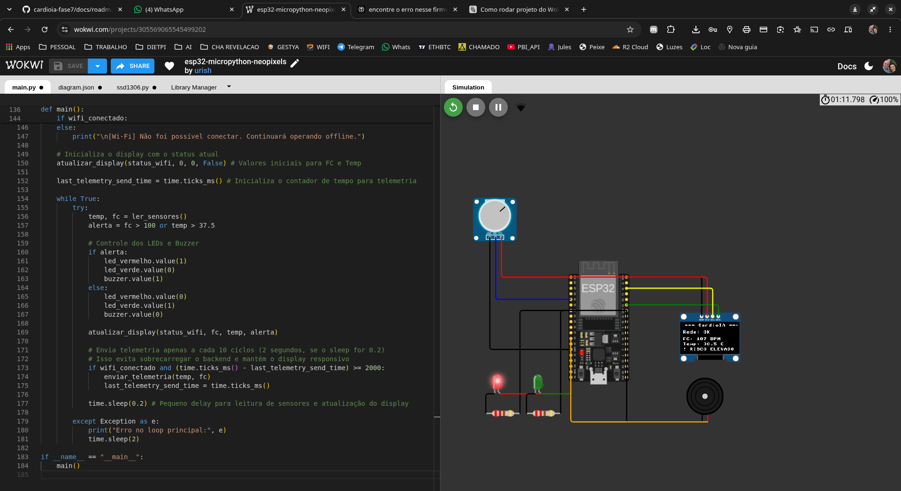

# CardioIA - Fase 6: Sistema Preditivo Multiagente para Eventos Cardíacos

## 👥 Integrantes do Grupo
**Turma: 2TIAOR**

| Nome | RM |
| :--- | :--- |
| Matheus Augusto Rodrigues Maia | RM 560683 |
| Bruno Henrique Nielsen Conter | RM 560518 |
| Fabio Santos Cardoso | RM 560479 |

Este repositório contém a implementação da Fase 6 do projeto CardioIA, que foca no desenvolvimento de um sistema preditivo multiagente para eventos cardíacos. O projeto integra um modelo de Machine Learning para previsão de risco com uma arquitetura multiagente baseada no **OpenAI Agents SDK**, utilizando o endpoint compatível do Google Gemini.

## Estrutura do Projeto

*   `backend/`: Pasta contendo a inteligência em Python do CardioIA:
    *   `cardioia_ml.py`: Geração da base de dados sintética e treinamento do modelo.
    *   `cardioia_evaluation.py`: Avaliação do modelo treinado e simulação de novo paciente.
    *   `cardioia_agents.py`: Implementação do sistema multiagente via OpenAI Agents SDK.
    *   `modelo_cardioia.pkl`: Modelo de Machine Learning serializado.
    *   `base_cardioia.csv`: Base de dados sintética gerada.
    *   `conf_matrix.png`: Matriz de confusão gerada na avaliação.
    *   `log_sistema.txt`: Log de saída da última execução do sistema multiagente.
*   `entregaveis/`: Pasta que centraliza os links oficiais de entrega (GitHub, Vercel, Expo, Wokwi, Vídeo):
    *   `entregaveis.txt`: Arquivo com a lista de links oficiais da entrega da Fase 7.
*   `iot/`: Pasta reservada para a implementação de hardware com MicroPython.
*   `docs/`: Pasta com documentações auxiliares do projeto:
    *   `enunciado_cap7_cardioia.md`: Enunciado da atividade da Fase 7.
    *   `roadmap.md`: Avaliação de completude e plano de ação detalhado para a Fase 7.
    *   `relatorio_tecnico_cardioia_fase6.pdf`: Relatório técnico detalhando o modelo preditivo (Fase 6 - renomeado).
    *   `arquitetura_multiagente_cardioia.pdf`: Documento de arquitetura do sistema multiagente (Fase 6).
    *   `arquitetura_multiagente_diagram.png`: Diagrama da arquitetura do sistema multiagente (Fase 6).
*   `cardioia_colab_notebook.ipynb`: Notebook Google Colab com a implementação da Parte 1 (modelo preditivo).
*   `README.md`: Este arquivo.

## Dependências

Para executar os scripts Python, você precisará das seguintes bibliotecas:

*   `pandas`
*   `numpy`
*   `scikit-learn`
*   `joblib`
*   `matplotlib`
*   `seaborn`
*   `openai` (cliente OpenAI para Python)
*   `openai-agents` (OpenAI Agents SDK)
*   `pydantic`

Você pode instalá-las usando pip:

```bash
pip install pandas numpy scikit-learn joblib matplotlib seaborn openai openai-agents pydantic python-dotenv
```

## Configuração

### Chave de API do Google Gemini

O sistema multiagente utiliza o **OpenAI Agents SDK** apontando para o endpoint compatível do Google Gemini. Para isso, é necessária uma chave de API do Google AI Studio (gratuita).

1.  Acesse [Google AI Studio](https://aistudio.google.com/) e gere uma chave de API.
2.  Abra o arquivo `.env` na raiz do projeto.
3.  Substitua `SUA_CHAVE_AQUI` pela chave que você acabou de gerar:
    ```env
    GOOGLE_API_KEY="AIzaSySuaChaveGerada..."
    ```

## Instruções de Execução

1.  **Geração de Dados e Treinamento do Modelo:**
    ```bash
    python cardioia_ml.py
    ```
    Este script irá gerar a base de dados sintética (`base_cardioia.csv`) e treinar o modelo (`modelo_cardioia.pkl`).

2.  **Avaliação do Modelo e Simulação:**
    ```bash
    python cardioia_evaluation.py
    ```
    Este script irá gerar a matriz de confusão (`conf_matrix.png`) e simular a previsão para um novo paciente.

3.  **Execução do Sistema Multiagente:**
    ```bash
    python cardioia_agents.py
    ```
    Este script demonstrará o fluxo de trabalho completo do sistema multiagente:
    - Recebe os dados do novo paciente.
    - O **Agente Orquestrador** coordena o fluxo via **handoffs**.
    - O **Agente Analista de Risco** consulta o modelo preditivo via **tool** `predict_risk`.
    - O **Agente Especialista em Protocolos** consulta a base de protocolos via **tool** `get_protocols`.
    - A resposta final é gerada de forma estruturada.
    - O histórico de mensagens e o log completo são salvos em `log_sistema.txt`.

## Arquitetura do Sistema Multiagente

O sistema utiliza o **OpenAI Agents SDK** com as seguintes funcionalidades:

| Funcionalidade | Implementação |
|---|---|
| **Agentes** | 3 agentes definidos com `Agent()`: Orquestrador, Analista de Risco, Especialista em Protocolos |
| **Handoffs** | Uso de `handoff()` para transferir controle entre o Orquestrador e os agentes especializados |
| **Tools** | `@function_tool` para `predict_risk` (modelo ML) e `get_protocols` (base de protocolos) |
| **Histórico de Mensagens** | Registrado via `result.to_input_list()` após execução pelo `Runner` |
| **Validação de Saída** | Modelo Pydantic `CardioIAOutput` para garantir formato estruturado |
| **LLM Backend** | Google Gemini (via endpoint OpenAI-compatível) |

---

## 🔌 Protótipo IoT & Simulação Wokwi

O circuito de hardware da CardioIA foi desenvolvido em **MicroPython** utilizando o microcontrolador **ESP32** no simulador **Wokwi** (código e diagrama de fiação disponíveis na pasta [`/iot`](./iot/)).

O circuito lê as pulsações por minuto (BPM) a partir de um potenciômetro analógico que simula as variações dos batimentos do paciente, processa clinicamente os alertas e atualiza os seguintes atuadores físicos:
- **Display OLED SSD1306**: Exibe o status da conexão Wi-Fi, frequência cardíaca local, temperatura corporal e o diagnóstico clínico em tempo real.
- **LED Verde**: Aceso quando as métricas clínicas estão normais.
- **LED Vermelho & Buzzer**: Ativados instantaneamente em caso de risco clínico elevado (Taquicardia ou Febre), emitindo sinal visual e alerta sonoro intermitente.

### 🟢 Estado Clínico Normal
O display OLED exibe `Sinais Normais`, o LED Verde está ativo e os alarmes estão desligados.


### 🔴 Estado Clínico de Risco (Alerta Ativo)
Ao girar o potenciômetro simulando taquicardia (> 100 bpm) ou febre (> 37.5°C), o display exibe `! RISCO ELEVADO !`, o LED Vermelho se acende e o Buzzer emite alertas intermitentes sonoros.


---

## 📱 Aplicativo Móvel (React Native + Expo)

Desenvolvido com **React Native** e **Expo SDK 51** (código e configurações localizados na pasta [`/mobile-app`](./mobile-app/)), o aplicativo do paciente integra:
- **Área do Paciente**: Login para acesso seguro à telemetria individual.
- **Monitoramento em Tempo Real**: Conexão com o backend FastAPI para receber e exibir os dados de frequência cardíaca e temperatura corporal.
- **Gráfico de Evolução**: Sparkline gráfico dinâmico desenhado para exibir o histórico cardíaco das últimas 15 leituras.
- **Integração de IA**: Botão para chamar a inferência clássica (Machine Learning) e a análise avançada (sistema multiagente da CardioIA).
- **Configuração de Publicação**: Identificador Android configurado como `br.com.fiap.cardioia` e EAS Build configurado com perfil `preview` para empacotamento em formato `.apk`.

---

## 🚀 Links de Entrega (Fase 7)

*   **Repositório GitHub (Privado):** [Link do Repositório](https://github.com/brunocorisco86/cardioia-fase7)
*   **URL Pública do Frontend (Vercel):** _[A preencher após o deploy]_
*   **Build Mobile (.apk no Expo):** _[A preencher após a geração do APK]_
*   **Simulação do Hardware (Wokwi):** _[A preencher após a montagem do circuito]_
*   **Vídeo Demonstrativo (Até 5 min):** _[A preencher após a gravação]_

