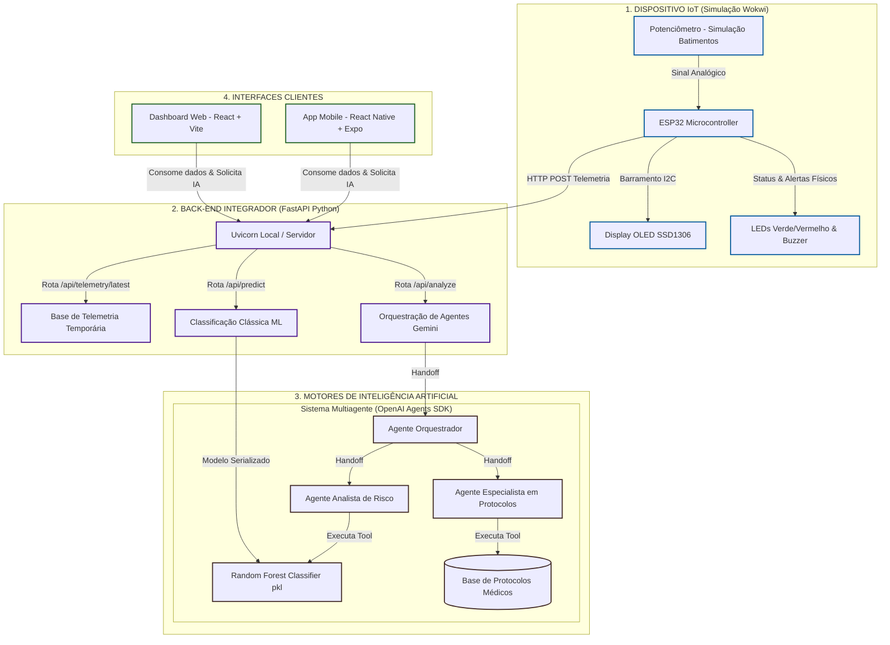

# 📝 Relatório Técnico Final — CardioIA (Fase 7)

**FIAP — Faculdade de Informática e Administração Paulista**  
**Curso:** Análise e Desenvolvimento de Sistemas  
**Turma:** 2TIAOR  
**Disciplina:** Integrations, IoT & AI Systems  

---

## 👥 Integrantes do Grupo
* **Matheus Augusto Rodrigues Maia** — RM 560683
* **Bruno Henrique Nielsen Conter** — RM 560518
* **Fabio Santos Cardoso** — RM 560479

---

## 1. Introdução e Visão Geral do Ecossistema

O projeto **CardioIA** consiste em um ecossistema de saúde preditivo e preventivo focado no monitoramento remoto e na identificação precoce de crises cardiovasculares. Integrando conceitos avançados de Internet das Coisas (IoT), Inteligência Artificial (hibridizando Machine Learning clássico e Grandes Modelos de Linguagem), Desenvolvimento Web e Mobile, o CardioIA estabelece um fluxo contínuo de aquisição de dados e tomada de decisão clínica contextualizada.

Nesta Fase 7, consolidamos o ecossistema integrado com:
1. **IoT (Dispositivo de Telemetria):** Leitura contínua simulada de temperatura e frequência cardíaca via MicroPython em um ESP32.
2. **Back-end Integrador (FastAPI):** Centralização dos dados de telemetria e exposição dos endpoints de inferência inteligente.
3. **Motores de IA:** Modelo de Machine Learning clássico (`Random Forest`) para cálculo rápido de risco e arquitetura multiagente cognitiva (`OpenAI Agents SDK` + `Google Gemini`) para análise clínica aprofundada e encaminhamento.
4. **Interfaces Clientes:** Dashboard Web (React + Vite) e Aplicativo Móvel (React Native + Expo) para visualização em tempo real e triagem médica.

---

## 2. Pilares Metodológicos e de Processos

A estruturação tecnológica e de comunicação do ecossistema CardioIA baseia-se em três pilares fundamentais, aplicáveis tanto à saúde assistida quanto adaptáveis a outros cenários críticos de automação de insumos monitorados pelo grupo (como o controle inteligente de entrega e nível de insumos e ração em silos agrícolas):

1. **Comunicação Eficiente (Plataforma Centralizada):**
   * Centralização dos dados históricos e em tempo real em uma API unificada. 
   * Acesso imediato dos profissionais de saúde e pacientes aos pareceres de IA através de canais web e móveis, eliminando silos informacionais.
2. **Processos Otimizados (Triagem e Confirmação):**
   * Redesenho do fluxo de atendimento ao paciente de risco por meio da automação de alertas e triagem inteligente baseada em protocolos clínicos.
   * Confirmação e geração automática de recomendações de suporte clínico síncrono.
3. **Tecnologia Habilitadora (Sensores e Conectividade IoT):**
   * Emprego de microcontroladores conectados com sensores biométricos de ponta.
   * Telemetria baseada em barramentos industriais de comunicação (ex: I2C) e envio dinâmico via rede Wi-Fi ao barramento de microsserviços.

---

## 3. Diagrama de Arquitetura Integrada (Fase 7)

O fluxo de dados fim-a-fim, partindo da leitura física nos sensores locais até a entrega do diagnóstico nas aplicações móvel e web, é estruturado conforme o diagrama a seguir (renderizável no editor *Dillinger*):

---

## 4. Detalhamento dos Componentes do Sistema

### 4.1. Módulo IoT e Dispositivos Físicos (MicroPython)
O firmware gravado no ESP32 (`main.py`) opera lendo o potenciômetro analógico (GPIO 34) e a temperatura. O microcontrolador processa localmente a criticidade:
* **Estado Normal (FC < 100 BPM e Temp < 37.5°C):** O LED Verde acende, o display OLED mostra `Sinais Normais` e os dados são transmitidos.
* **Estado Crítico (FC >= 100 BPM ou Temp >= 37.5°C):** O LED Vermelho acende, o Buzzer sonoro emite um alarme intermitente, e o display exibe `! RISCO ELEVADO !`.
* **Transmissão:** Os dados de batimentos, temperatura e alertas locais são encapsulados em JSON e enviados via requisições HTTP POST para o endpoint `/api/telemetry` da API central.

### 4.2. Back-end e Barramento de Serviços (FastAPI)
O backend Python expõe endpoints HTTP REST rodando sob o servidor Uvicorn na porta 8000:
* **POST `/api/telemetry`:** Recebe leituras em tempo real enviadas pela placa IoT e armazena no estado da aplicação.
* **GET `/api/telemetry/latest`:** Serve as leituras biométricas mais recentes aos painéis do paciente (Mobile) e do médico (Web).
* **POST `/api/predict`:** Executa a inferência síncrona do modelo de ML clássico.
* **POST `/api/analyze`:** Dispara a execução síncrona do Runner da arquitetura multiagente.

### 4.3. Hibridização de Motores de Inteligência Artificial
A CardioIA utiliza duas frentes integradas de IA para otimizar tempo de resposta e profundidade analítica:
1. **Machine Learning Clássico (Random Forest):** Classificador treinado para prever probabilidade de risco clínico baseado em idade, batimentos, SpO2 e histórico cardíaco. Devido ao baixo consumo computacional e tempo de resposta na casa dos milissegundos, é ideal para triagens de alto fluxo.
2. **Sistema Multiagente Cognitivo (OpenAI Agents SDK + Gemini):** Para casos complexos ou necessidade de direcionamento clínico, o **Agente Orquestrador** realiza *handoffs* para o **Agente Analista de Risco** (que consome o modelo clássico) e para o **Agente Especialista em Protocolos** (que consulta diretrizes clínicas com base em evidências). A resposta final gera uma justificativa humanizada e detalhada para o paciente e médico.

---

## 5. Justificativa da Hibridização da Inteligência Artificial

A arquitetura de IA híbrida adota a melhor característica de cada abordagem tecnológica:

| Característica | ML Clássico (Random Forest) | IA Generativa & Agentes (LLM) |
| :--- | :--- | :--- |
| **Tempo de Execução** | Instantâneo (milissegundos) | Segundos (dependente de chamadas de rede) |
| **Custo de Processamento** | Praticamente zero localmente | Requer tokens e requisições de API na nuvem |
| **Explicabilidade** | Limitada a coeficientes numéricos | Alta capacidade de traduzir em texto natural humano |
| **Tomada de Decisão** | Rápida classificação binária | Cruzamento dinâmico com diretrizes e protocolos médicos |

Ao integrar ambas na CardioIA, o sistema provê respostas instantâneas (via ML clássico) exibidas nos dashboards e, caso necessário ou sob requisição ativa, engaja a arquitetura multiagente para gerar diagnósticos ricos e humanizados estruturados sob validações estritas (Pydantic).

---

## 6. Conclusões e Considerações sobre Governança de Dados

A Fase 7 consolidou com sucesso o MVP do CardioIA, provando a viabilidade de conectar sensores físicos baseados em MicroPython a dashboards em tempo real (Web e Mobile) alimentados por inteligência preditiva mista. 

Em conformidade com a **Lei Geral de Proteção de Dados (LGPD)**, o ecossistema foi desenhado com foco em segurança da informação:
* Autenticação segura de acesso na área do paciente.
* Variáveis sensíveis e credenciais de nuvem (como a `GOOGLE_API_KEY`) protegidas por variáveis de ambiente (`.env`) e excluídas do controle de versão Git.
* Abertura para anonimização dos dados clínicos enviados às APIs de IA generativa externas, preservando a identidade civil do indivíduo.
